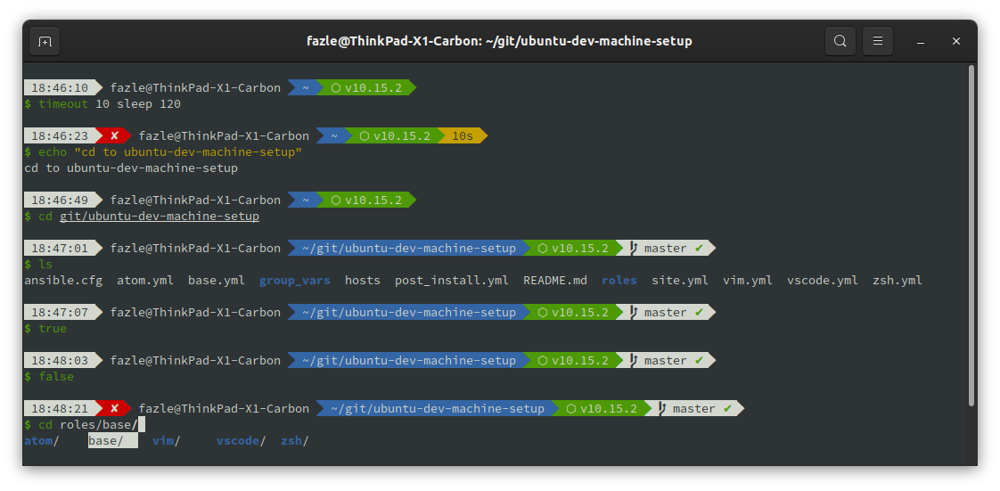
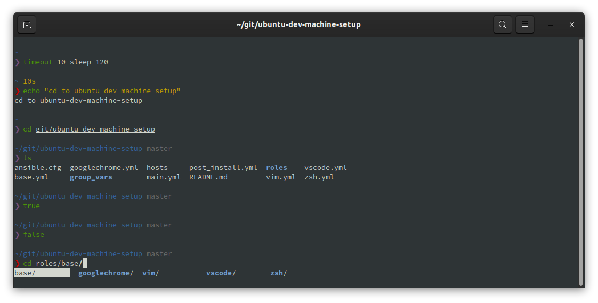
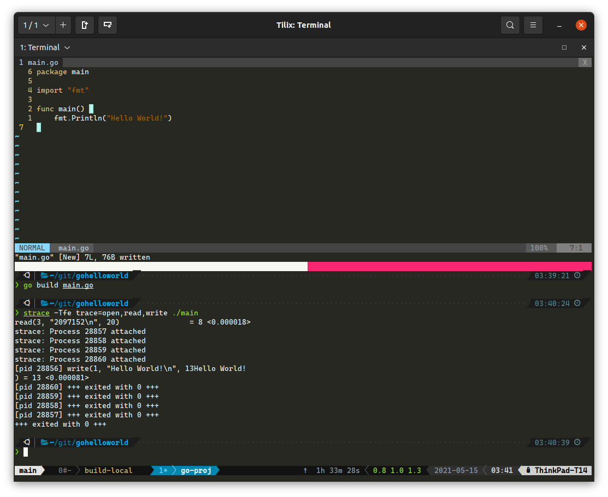

# Post-Install-Ubuntu | Ubuntu 22.04

## Description

Ce référentiel contient des playbooks Ansible pour configurer votre système en tant que machine de développement lors d'une nouvelle installation.

Les playbooks doivent s'exécuter sur un système basé sur Debian, mais n'ont été testés qu'avec :
- **Ubuntu 22.04**
- **Pop!_OS 22.04**

Pour les autres versions d'Ubuntu, passez aux autres branches de ce dépôt git. Les autres versions incluent Ubuntu 18.04 LTS et 20.04 LTS.



La capture d'écran ci-dessus utilise *bullet-train zsh theme*



La capture d'écran ci-dessus utilise *pure zsh theme*



La capture d'écran ci-dessus utilise *p10k zsh theme with tmux*

---

## Qu'est-ce qui est installé et configuré ?

Je suis un ingénieur DevSecOps (axé sur Linux) et mon travail quotidien consiste à travailler avec diverses gestions de configuration à l'aide d'Ansible. Donc, si vous êtes dans une profession similaire, le système installé répondra à vos besoins. Il est également facile d'étendre l'utilisation des rôles Ansible.

Résumé des packages installés et configurés en fonction des rôles :

- **role: base**
  - monter `/tmp` sur tmpfs (réduire les écritures en lecture SSD et augmenter la durée de vie du SSD ; pas de fichiers restants à l'arrêt du système)
  - définir l'éditeur système par défaut sur vim au lieu de nano
  - activer le pare-feu ufw et installer l'interface graphique ufw gufw
  - désactiver les rapports de plantage du système
  - régler le swap du système afin que le swapping soit considérablement réduit
  - mettre à niveau tous les packages
  - installer des outils d'archivage comme zip, rar, etc.
  - installer libreoffice
  - installer des outils de gestion de l'alimentation comme [TLP](https://github.com/linrunner/TLP)
  - installer des packages liés au développement tels que docker, podman, filezilla, golang, pipenv, etc.
  - configurer les répertoires golang
  - installer des outils de téléchargement comme transmission, wget
  - installer des packages image, audio et vidéo comme vlc, gimp, imagemagick.
  - installer des outils de virtualisation comme virtualbox, docker, docker-compose
  - installer et configurer le serveur ssh s'il n'est pas défini sur `laptop_mode`
  - possibilité d'activer les paramètres de luminosité pour le confort des yeux (régler `base_permanent_night_light.night_light_enabled` à `True`)

- **role: hashicorp**
  - installer vagrant et terraform
- **role: terminal_customizations**
  - téléchargez et installez des polices à partir de ryanoasis/nerd-fonts ; ce sont des polices mono idéales pour une utilisation dans les éditeurs de terminaux ou de programmation
  - copier et activer un exemple de fichier de configuration tilix avec la police nerd configurée
- **role: vim**
  - installer les paquets vim
  - installer amix/vimrc distribution vim
  - créer un exemple de fichier de personnalisation vim dans `~/.vim_runtime/my_configs.vim`
    - des paramètres vim supplémentaires sont activés dans `~/.vim_runtime/my_configs.vim` qui ne font pas partie de la distribution Vim. Modifiez ce fichier si nécessaire.
- **role: zsh**
  - installez le package zsh et définissez le shell utilisateur sur zsh
  - installer le gestionnaire de plugin antigen zsh
  - copier et activer `~/.zshrc` fichier s'il n'existe pas
    - contient une fonction pour empêcher ssh-agent de demander à plusieurs reprises le mot de passe de la clé ssh cryptée lors du lancement d'un nouveau terminal
  - installez ohmyzsh/ohmyzsh et activez certains plugins
  - activer le thème zsh powerlevel10k
- **role: googlechrome**
  - ajouter le référentiel Google Chrome apt
  - installer Google Chrome
- **role: vscode**
  - ajouter le référentiel apt Visual Studio Code
  - installer Visual Studio Code
  - installer certaines extensions populaires de Visual Studio Code
- **role: privacy**
  - installer tor
  - configurer tor pour qu'il s'exécute au démarrage et empêche l'utilisation de certains pays comme nœuds de sortie
    - editer `/etc/tor/torrc` si nécessaire
  - installer proxychains
  - configurer les proxychains pour utiliser tor. Voir [my Medium story](https://fazlearefin.medium.com/tunneling-traffic-over-tor-network-using-proxychains-34c77ec32c0f) pour voir comment l'utiliser
    - editer `/etc/proxychains4.conf` si nécessaire
  - installer la boîte à outils d'anonymisation des métadonnées
- **role: security**
  - installez ClamAV (antivirus) et l'interface ClamAV GNOME. Analyse manuelle à partir de Nautilus ou de la CLI à l'aide de `clamscan`; clamd non installé à cause de son énorme empreinte mémoire

---

## Step 0 | Prérequis pour exécuter les playbooks ansible

Sur le système que vous allez configurer à l'aide d'Ansible, effectuez ces étapes.

Vous devez installer `ansible` et `git` avant d'exécuter les playbooks. Vous pouvez soit l'installer en utilisant`pip` ou `apt`.

```bash
sudo apt update
sudo apt install ansible git -y
```

Et clonez ce dépôt (ne clonez pas dans `/tmp` car ce répertoire est nettoyé et monté dans tmpfs)

```bash
git clone https://github.com/Mounik/post-install.git
cd post-install
```

## Step 1 | Exécution des playbooks pour configurer votre système

**Lancez ce qui suit en tant qu'utilisateur principal du système. Ne lancez pas en tant que `root`.**

```bash
ansible-playbook main.yml -vv -e "{ laptop_mode: True }" -e "local_username=$(id -un)" -K
```

Entrez le mot de passe sudo lorsqu'on vous le demande `BECOME password:`.

Le `main.yml` playbook prendra entre 15 minutes et une heure à compléter.

Une fois que tout est fait, donnez une nouvelle vie à votre ordinateur en redémarrant.

> ### Qu'est-ce que c'est`laptop_mode`?

#### Régler ceci sur `True`

- va installer certains packages comme[TLP](https://github.com/linrunner/TLP) pour l'économie de la batterie

#### Régler ceci sur `False`

- n'installera PAS certains packages comme [TLP](https://github.com/linrunner/TLP) pour l'économie de la batterie

---

## Problèmes connus

- Si le playbook ansible s'arrête après avoir terminé quelques tâches, exécutez simplement le playbook à nouveau. Étant donné que la plupart des tâches sont idempotentes, exécuter le playbook plusieurs fois ne cassera rien.
- Si votre terminal affiche des caractères étranges en raison de l'installation de l'un des thèmes zsh, changez simplement la police en une police appropriée à partir des paramètres du terminal.

---

## Pull Requests et Forks

Vous êtes plus que bienvenu pour envoyer des pull requests. Cependant, l'intention de ce dépôt est de répondre à mes besoins de développement. Il serait donc préférable que vous *forkiez* ce référentiel à la place pour vos propres besoins et personnalisation.

---

